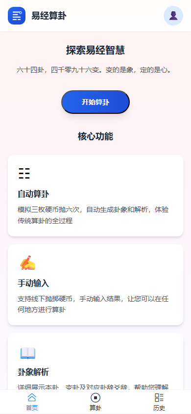

<p align="center">
  
</p>

<h1 align="center">Gua64 · 六十四</h1>

基于 **Vue 3** + **Capacitor** 的移动端易学应用：通过 **三枚硬币** 自动起卦，也支持线下抛掷后 **手动录入**；生成结果后展示 **本卦 / 变卦 / 卦辞 / 爻辞 / 彖辞 / 象辞 / 河洛理数 / 吉凶平** 等多维度文献，并用 **SQLite** 在本地保存历史。界面使用 **Vant 4** 与 **UnoCSS**，按移动端体验设计与打包。

> 六十四卦，四千零九十六变。变的是象，定的是心。

[](https://vuejs.org/)
[](https://www.typescriptlang.org/)
[](https://vite.dev/)
[](https://capacitorjs.com/)
[](https://vant-ui.github.io/vant/)
[](https://nodejs.org/)
[](https://opensource.org/licenses/MIT)
[](./package.json)

| [开发部署](./docs/开发部署.md) | [开发指南](./docs/开发指南.md) | [开发日志](./docs/开发日志.md) | [项目配置](./package.json) |
| :--: | :--: | :--: | :--: |

---

## 项目背景

易学（周易）是中国传统文化的重要组成部分，但传统起卦方式门槛很高：

- **不懂起卦**：不知道三枚硬币如何对应六爻，不知道如何确定本卦和变卦
- **不会查卦**：掷完硬币得到六个爻，却不知道这是什么卦，上网搜索也不知道怎么描述
- **文献分散**：卦辞、爻辞、彖辞、象辞等文献分散在不同书籍中，查阅麻烦
- **记录困难**：纸质记录容易丢失，不方便回顾和整理

**Gua64** 让传统易学现代化，降低起卦门槛，提供便捷的卦局生成与文献查阅工具。

---

## 特性

### 核心功能（已完成）

- **自动算卦**：模拟三枚硬币抛掷，自动生成六爻与卦象
- **手动录入**：支持线下抛掷后逐爻录入，适配真实起卦流程
- **多维文献**：集中展示本卦、变卦、卦辞、爻辞、彖辞、象辞、河洛理数、吉凶平及译文
- **变爻高亮**：自动计算并高亮显示变爻，清晰展示本卦到变卦的变化
- **历史记录**：使用 `@capacitor-community/sqlite` 在本地保存算卦结果，随时回顾
- **占事录入**：起卦前输入所占之事，为未来 AI 解卦预留数据支持

### 规划功能（P1 - 2026-06）

- **卦局收藏**：收藏重要卦局，支持分类管理（工作、感情、投资、健康、学习等）
- **卦局编辑**：自定义标题、添加个人笔记
- **卦局管理**：删除单条/批量删除/清空卦局历史
- **搜索功能**：按卦名、卦局标题、标签、笔记内容搜索卦局
- **卦象浏览**：完整的六十四卦知识库浏览
- **分类筛选**：支持按八卦分类、按吉凶筛选
- **卦局分享**：生成卦局图片，调用系统分享功能
- **应用设置**：字体大小、主题切换、硬币样式、清除数据等
- **使用帮助**：起卦方法说明、界面引导
- **数据统计**：最常出现的卦、变爻分布、时间轴回顾、同一卦的历史记录

### 规划功能（P2 - 2026-Q3）

- **数据导入导出**：导出/导入 JSON 文件，支持迁移备份
- **卦局对比**：并排对比两个卦局的本卦、变卦、变爻差异
- **导出增强**：支持导出 PDF、长图等多种格式

### 产品特色

- **现代化界面**：Vant 4 组件，美观简洁
- **双模式起卦**：自动+手动，覆盖不同场景
- **本地存储**：隐私安全，历史不丢失，完全离线可用
- **多维文献**：整合吉凶平、河洛理数、卦辞、彖辞、象辞等多维度内容
- **单机定位**：无需联网，随时随地使用

---

## 安装

需要 **Node.js 18+**；如需构建 Android 应用，还需要 **Android Studio**。

```bash
git clone <你的仓库地址>
cd gua64-app
npm install
```

开发模式：

```bash
npm run dev
```

生产构建与预览：

```bash
npm run build
npm run preview
```

---

## 技术栈

| 类别 | 技术 |
|------|------|
| 前端框架 | Vue 3 + TypeScript |
| 构建工具 | Vite |
| UI 组件库 | Vant 4 |
| 样式方案 | UnoCSS + Sass |
| 状态管理 | Pinia |
| 路由 | Vue Router |
| 移动端 | Capacitor |
| 本地存储 | SQLite（`@capacitor-community/sqlite`） |
| 辅助组件 | `draw-empty` |
| 黄历计算 | `lunar-typescript` |

---

## 预览

| 首页 | 算卦入口 | 历史（空状态） |
|------|----------|----------------|
|  |  |  |

---

## Android 构建

先构建 Web 资源，再同步到 Capacitor Android 工程：

```bash
npm run build
npx cap sync android
npx cap open android
```

详细环境配置、真机运行与打包流程见 [**开发部署.md**](./docs/开发部署.md)。

---

## 常用脚本

| 命令 | 说明 |
|------|------|
| `npm run dev` | 启动 Vite 开发服务器 |
| `npm run build` | TypeScript 类型检查 + Vite 生产构建 |
| `npm run preview` | 本地预览构建产物 |
| `npm run icons:android` | 使用 `public/logo.svg` 生成 Android 图标 |

设计规范、目录约定与 AI 协作规则见 [**开发指南.md**](./docs/开发指南.md)；AI 辅助变更记录见 [**开发日志.md**](./docs/开发日志.md)。

---

## 项目里程碑

| 阶段 | 交付物 | 截止日期 | 状态 |
|------|--------|----------|------|
| 需求分析 | 需求文档 | 2026-03 | ✅ 已完成 |
| 原型设计 | 可交互原型 | 2026-03 | ✅ 已完成 |
| 视觉设计 | UI设计稿 | 2026-04 | ✅ 已完成 |
| 设计评审 | 评审报告 | 2026-04 | ✅ 已完成 |
| 开发跟进 | 设计走查 | 2026-04 | ✅ 已完成 |
| P1功能开发 | 卦局收藏、编辑、管理、搜索、卦象浏览、分类筛选、分享、设置、帮助、数据统计 | 2026-06 | ⏳ 待开始 |
| P2功能开发 | 数据导入导出、卦局对比、导出增强 | 2026-Q3 | ⏳ 待开始 |

---

## 设计稿

- **Axure RP 源文件**：[`design/rp/`](./design/rp/)
- **导出预览 / HTML**：`design/exports/`（已在 `.gitignore` 忽略，默认不提交）

---

## 许可

- 仓库代码：**MIT**
- 硬币等第三方素材：见对应目录的 **`ATTRIBUTION.txt`**
- draw-empty 插图：遵循 [unDraw 许可](https://undraw.co/license)
